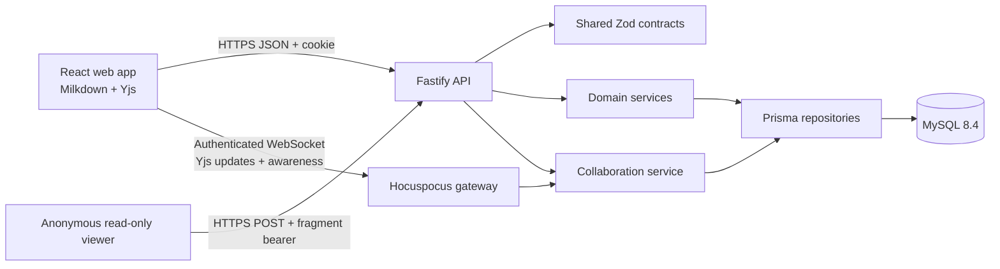
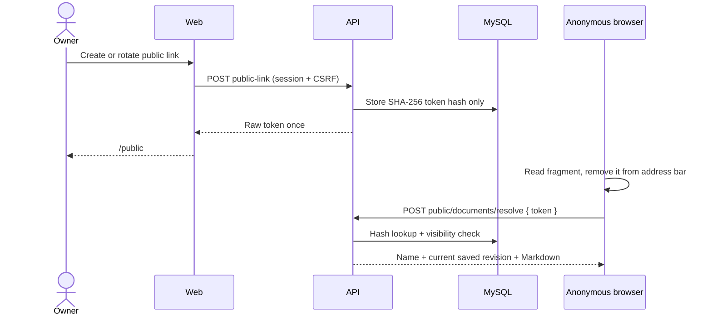

# Architecture

## Context

TeamMD is a browser application backed by a versioned HTTP API, a Hocuspocus WebSocket gateway, and MySQL. Yjs provides simultaneous character-level synchronization while explicit immutable checkpoints remain the user-visible history model.



## Deployment Shape

Start as a modular monolith with independently deployable web and API artifacts:

- The web app is static content served through a CDN or same-site web host.
- The API and collaboration gateway are Node.js processes behind TLS and a reverse proxy.
- MySQL is the transactional source of truth.
- Sessions, permissions, revisions, and compacted Yjs room state live in MySQL rather than browser or API process memory.
- The initial collaboration gateway is single-instance. Horizontal deployment requires room affinity or shared pub/sub before adding gateway instances.

Prefer same-site deployment such as `app.example.com` and `api.example.com`. If origins differ, use an explicit CORS allowlist with credentials; never use wildcard origins.

## Monorepo Ownership

### `apps/web`

- Routes and authenticated application shell
- File tree, Shared with me, Trash, editor, history, sharing, and anonymous public-document views
- Milkdown/Yjs/Hocuspocus lifecycle adapter and rendered-in-place editing
- Sanitized Vditor rendering for immutable history and anonymous public documents
- API client, query cache, dirty-state guards, full-screen/editor-history chrome, and conflict UI
- Presentation-only permission checks

Suggested internal layout:

```text
src/
  app/              providers, router, application shell
  features/         auth, workspace, editor, history, sharing
  components/       reusable accessible UI
  lib/              API client, errors, utilities
  styles/           tokens and global styles
  test/             test setup and fixtures
```

### `apps/api`

- Fastify composition, plugins, middleware, and versioned routes
- Domain services for identity, workspace, revisions, sharing, and audit
- Authorization policies executed before repository operations
- Prisma repositories and transaction boundaries
- Email and clock/token adapters for testability

Suggested internal layout:

```text
src/
  app.ts            construct Fastify without listening
  server.ts         validate config and listen
  plugins/          auth, csrf, rate limits, request context
  modules/
    auth/
    workspace/
    revisions/
    sharing/
    audit/
  infrastructure/   Prisma, email, hashing, token implementations
  test/              builders and integration harness
prisma/
  schema.prisma
  migrations/
```

Routes parse and serialize. Services own use cases and transactions. Repositories own persistence mechanics. Authorization must not be delegated to route naming or client state.

### Shared Packages

- `packages/contracts`: Zod schemas, inferred DTO types, pagination, IDs, roles, and stable error codes. It contains no database or framework code.
- `packages/config`: server environment schemas and shared tooling configuration. Browser-safe public config must have a separate explicit export.

## Primary Flows

### Save A Collaborative Document

```mermaid
sequenceDiagram
  actor User
  participant Web
  participant API
  participant Room as Hocuspocus room
  participant DB as MySQL
  User->>Web: Save
  Web->>Room: Flush pending Yjs updates
  Room-->>Web: Updates synchronized
  Web->>API: POST collaboration-checkpoint
  API->>API: Recheck active editor/owner access
  API->>Room: Read authoritative Yjs document
  API->>DB: Begin transaction; lock document row
  API->>DB: Insert immutable revision
  API->>DB: Advance head and write audit event
  API->>DB: Commit
  API-->>Web: New revision metadata + content hash
  API-->>Room: Broadcast checkpoint metadata
```

The collaborative client never submits whole-document Markdown for a checkpoint. The server reads the authoritative room, serializes its versioned structured state to canonical Markdown, creates a snapshot, and advances the head transactionally. The legacy full-document save contract retains `baseRevisionId` conflict protection for non-collaborative callers, but it is not the writable collaborative editor path.

### Grant Registered Account Access

1. The owner submits the email of an existing active account and an editor/viewer role.
2. The API verifies ownership, normalizes the email, upserts document access, and records an audit event in one transaction.
3. The document appears in the recipient's virtual Shared with me view without owner folder metadata.
4. Grant, role change, and revocation close all active connections in that document room. Reconnecting clients obtain a fresh one-time ticket and revalidate current access.

Pending-email token invitations and email delivery may be added later over the same `DocumentAccess` grant boundary.

### Restore A Revision

1. An owner or editor selects a historical revision while the current document is synchronized and has no unsaved draft.
2. The API row-locks the document, verifies the submitted current head, copies the selected Markdown into a new immutable revision, records lineage, and advances the head.
3. The transaction replaces persisted Yjs state, advances the collaboration checkpoint, and increments the room generation.
4. The collaboration gateway replaces the active room text, emits a `document-restored` control event, and closes room connections.
5. Each browser fetches the authorized current document and creates a fresh Yjs document/provider. It never merges the restored generation into a stale local `Y.Doc`.

### Publish A Read-Only Link



The bearer token never appears in an HTTP path, query string, referrer, cookie, or persisted browser storage. Public resolution is rate-limited and returns `private, no-store`. It exposes no Yjs draft, revision history, owner identity, collaborator list, or folder metadata. Rotation invalidates the old token; revocation deletes the hash.

## Authorization Model

Permissions are document-scoped:

| Action                   | Owner | Editor | Viewer        |
| ------------------------ | ----- | ------ | ------------- |
| Read current document    | Yes   | Yes    | Yes           |
| Save new revision        | Yes   | Yes    | No            |
| Read revision content    | Yes   | Yes    | No by default |
| Restore revision         | Yes   | Yes    | No            |
| Invite/change/revoke     | Yes   | No     | No            |
| Manage public link       | Yes   | No     | No            |
| Move/rename/trash/delete | Yes   | No     | No            |

Private folder hierarchy belongs only to its owner. A collaborator sees shared document metadata through a virtual Shared with me query and learns no parent-folder details.

Authorization queries must combine resource lookup and access checks where practical. Unauthorized and nonexistent private resources return the same `404 RESOURCE_NOT_FOUND` response to reduce enumeration.

## Consistency And Transactions

Transactions are mandatory for:

- revision insert + document head advance + audit event;
- direct access grant/update/revocation + audit event;
- public-link create/rotate/revoke + audit event;
- subtree trash, restore, move, and permanent deletion;
- session creation/rotation and logout-all epoch updates where applicable.

Use MySQL `InnoDB`, foreign keys, and `utf8mb4`. Set transaction isolation explicitly after testing Prisma behavior; save operations rely on a row lock or equivalent conditional update, not isolation defaults alone.

## Scale And Performance

- Cursor pagination for documents, shared items, revisions, sessions, and audit data.
- Index normalized email, owner/parent/name keys, document access by user, session token hash, and revision `(documentId, ordinal)`.
- Keep revision bodies out of tree and history-list queries.
- Enforce request body and Markdown byte limits before expensive work.
- Add object storage only when measured revision size/cost warrants it; MySQL remains sufficient for initial bounded text snapshots.

## Observability

Every request receives a request ID. Structured logs include route template, status, latency, actor ID when authenticated, and stable error code. Security-relevant actions create durable audit events. Metrics cover request latency/error rate, save outcomes/conflicts, login throttling, email failures, connection-pool saturation, and migration health.

Document content, passwords, cookies, CSRF values, public-link or invitation tokens, raw email bodies, and full request payloads are never logged.

## Real-Time Collaboration

Real-time collaboration is an additive boundary, not an altered meaning of the save endpoint. The collaboration module authenticates WebSocket upgrades with short-lived one-time tickets, authorizes Yjs rooms through the same document policy as HTTP, persists CRDT updates, and materializes immutable Markdown checkpoints on explicit Save. Milkdown is the sole writable rendered-in-place editor and binds its ProseMirror document to a versioned Yjs `XmlFragment`; Vditor is read-only and limited to sanitized history/public rendering. Presence remains ephemeral. Explicit revision history, revocation, export, and conflict recovery remain supported throughout migration. See ADR 0002 and ADR 0004.

The browser editor adapter also owns accessibility corrections for dynamically mounted Crepe controls. It adds missing accessible names, focusability, and keyboard-to-pointer activation while still dispatching through Crepe's native command handlers; it never mirrors content or maintains a parallel formatting state.

Mermaid editor previews use Crepe's existing fenced-code preview hook. The toolbar and add-block menu expose Mermaid as a first-class Diagram action, but that action still inserts the canonical `code_block` with exact lowercase `mermaid` language and starter source. The `code_block` and its CodeMirror source remain mounted and authoritative; a lazy, editor-scoped renderer derives sanitized SVG and returns it to Crepe's disposable preview panel. Rendering changes neither the Milkdown schema nor the Yjs state format. The renderer serializes work, ignores results after editor teardown, applies source-size, line-count, and time limits, and removes scripts, links, HTML integration points, event/style attributes, and generated style elements before insertion. Trusted application CSS supplies the discarded presentation. A disposable clone is measured under that final CSS so the returned SVG receives a fitted viewBox without first entering a hidden measurement tree. Compact diagrams use intrinsic sizing and responsive downscaling; wide timeline diagrams preserve readable intrinsic scale inside the preview's horizontal scroller. Post-sanitization repair may preserve only same-document SVG references whose prefixed target IDs exist in the sanitized tree; external, malformed, and broken references are removed. A future visual node view must translate supported direct-manipulation operations back into this same source node and fall back to source editing for unsupported Mermaid syntax; it may not own parallel writable graph state. Static history and public rendering remain a separate read-only integration.

Existing `Y.Text('content')` rooms use the legacy state format. A request for a structured editor ticket triggers conversion before the final ticket is issued. Conversion runs while the room is serialized and disconnected: preserve the complete operational draft, verify Markdown fidelity, create a fresh structured Yjs document, persist the new format, and increment the generation. Ticket negotiation prevents legacy and structured clients from creating parallel writable roots.

If collaboration cannot initialize, the browser may create a standalone Milkdown editor from the current immutable revision. This degraded mode requires HTTP connectivity, has no presence or live merging, and saves through the whole-document endpoint with `baseRevisionId`, so a newer document head produces `409 REVISION_CONFLICT` instead of an overwrite. An already-initialized Yjs draft is not silently converted into standalone state after a transient disconnect.

Transient reconnect is supported. Durable offline-first editing is deliberately separate from reconnect: it requires browser-side Yjs persistence, bounded queues, generation-aware restore handling, offline revocation semantics, and tested multi-device reconciliation. The current release does not claim offline-first behavior.
