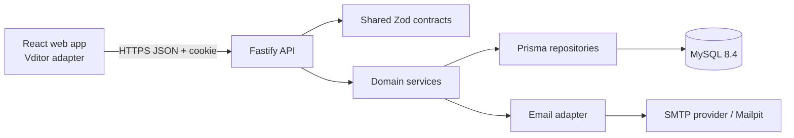

# Architecture

## Context

MyMD is a browser application backed by a versioned HTTP API and MySQL. The MVP uses explicit document saves with optimistic concurrency. It supports multiple people editing the same shared document over time, but not simultaneous character-level synchronization.



## Deployment Shape

Start as a modular monolith with independently deployable web and API artifacts:

- The web app is static content served through a CDN or same-site web host.
- The API is a stateless Node.js process behind TLS and a reverse proxy.
- MySQL is the transactional source of truth.
- Email is accessed through an adapter so local Mailpit and a production provider share one interface.
- Multiple API instances are safe because sessions, locks, permissions, and revisions live in MySQL rather than process memory.

Prefer same-site deployment such as `app.example.com` and `api.example.com`. If origins differ, use an explicit CORS allowlist with credentials; never use wildcard origins.

## Monorepo Ownership

### `apps/web`

- Routes and authenticated application shell
- File tree, Shared with me, Trash, editor, history, and sharing views
- Vditor lifecycle adapter and Markdown preview sanitization
- API client, query cache, dirty-state guards, and conflict UI
- Presentation-only permission checks

Suggested internal layout:

```text
src/
  app/              providers, router, application shell
  features/         auth, workspace, editor, history, sharing
  components/       reusable accessible UI
  lib/              API client, errors, utilities
  styles/           tokens and global styles
  test/             test setup and fixtures
```

### `apps/api`

- Fastify composition, plugins, middleware, and versioned routes
- Domain services for identity, workspace, revisions, sharing, and audit
- Authorization policies executed before repository operations
- Prisma repositories and transaction boundaries
- Email and clock/token adapters for testability

Suggested internal layout:

```text
src/
  app.ts            construct Fastify without listening
  server.ts         validate config and listen
  plugins/          auth, csrf, rate limits, request context
  modules/
    auth/
    workspace/
    revisions/
    sharing/
    audit/
  infrastructure/   Prisma, email, hashing, token implementations
  test/              builders and integration harness
prisma/
  schema.prisma
  migrations/
```

Routes parse and serialize. Services own use cases and transactions. Repositories own persistence mechanics. Authorization must not be delegated to route naming or client state.

### Shared Packages

- `packages/contracts`: Zod schemas, inferred DTO types, pagination, IDs, roles, and stable error codes. It contains no database or framework code.
- `packages/config`: server environment schemas and shared tooling configuration. Browser-safe public config must have a separate explicit export.

## Primary Flows

### Save A Document

```mermaid
sequenceDiagram
  actor User
  participant Web
  participant API
  participant DB as MySQL
  User->>Web: Save
  Web->>API: PUT document content + baseRevisionId
  API->>DB: Begin transaction; lock document row
  API->>DB: Recheck active editor/owner access
  API->>DB: Compare currentRevisionId with baseRevisionId
  alt stale base
    API-->>Web: 409 REVISION_CONFLICT + current head metadata
  else current base
    API->>DB: Insert immutable revision
    API->>DB: Advance head and write audit event
    API->>DB: Commit
    API-->>Web: 200 document + new revision metadata
  end
```

The API may accept the word “overwrite” in UI language, but persistence never updates revision content in place. A transaction creates a snapshot and advances the head. The row lock and base comparison serialize concurrent saves.

### Invite And Accept

1. The owner submits normalized target email and role.
2. The API verifies ownership, rate limits the action, invalidates equivalent outstanding invitations, stores only a hash of a high-entropy token, and sends the raw token in a link.
3. The authenticated recipient submits the token. The API hashes it, locks the invitation, checks expiry/use/email match, upserts document access, marks the invitation used, and records an audit event in one transaction.
4. Role change or revocation takes effect on the next API request; an open editor cannot bypass the server check.

## Authorization Model

Permissions are document-scoped:

| Action                   | Owner | Editor | Viewer        |
| ------------------------ | ----- | ------ | ------------- |
| Read current document    | Yes   | Yes    | Yes           |
| Save new revision        | Yes   | Yes    | No            |
| Read revision content    | Yes   | Yes    | No by default |
| Restore revision         | Yes   | Yes    | No            |
| Invite/change/revoke     | Yes   | No     | No            |
| Move/rename/trash/delete | Yes   | No     | No            |

Private folder hierarchy belongs only to its owner. A collaborator sees shared document metadata through a virtual Shared with me query and learns no parent-folder details.

Authorization queries must combine resource lookup and access checks where practical. Unauthorized and nonexistent private resources return the same `404 RESOURCE_NOT_FOUND` response to reduce enumeration.

## Consistency And Transactions

Transactions are mandatory for:

- revision insert + document head advance + audit event;
- invitation acceptance + access upsert + invitation consumption + audit event;
- role change/revocation + invitation cleanup + audit event;
- subtree trash, restore, move, and permanent deletion;
- session creation/rotation and logout-all epoch updates where applicable.

Use MySQL `InnoDB`, foreign keys, and `utf8mb4`. Set transaction isolation explicitly after testing Prisma behavior; save operations rely on a row lock or equivalent conditional update, not isolation defaults alone.

## Scale And Performance

- Cursor pagination for documents, shared items, revisions, sessions, and audit data.
- Index normalized email, owner/parent/name keys, document access by user, invitation token hash, session token hash, and revision `(documentId, ordinal)`.
- Keep revision bodies out of tree and history-list queries.
- Enforce request body and Markdown byte limits before expensive work.
- Add object storage only when measured revision size/cost warrants it; MySQL remains sufficient for initial bounded text snapshots.

## Observability

Every request receives a request ID. Structured logs include route template, status, latency, actor ID when authenticated, and stable error code. Security-relevant actions create durable audit events. Metrics cover request latency/error rate, save outcomes/conflicts, login throttling, email failures, connection-pool saturation, and migration health.

Document content, passwords, cookies, CSRF values, invitation tokens, raw email bodies, and full request payloads are never logged.

## Evolution To Real-Time

Real-time collaboration is an additive boundary, not an altered meaning of the save endpoint. A future collaboration module can authenticate WebSocket upgrades, authorize Yjs rooms, persist CRDT updates, and materialize immutable Markdown checkpoints. Presence remains ephemeral. Explicit revision history, revocation, export, and conflict recovery stay supported throughout migration.
