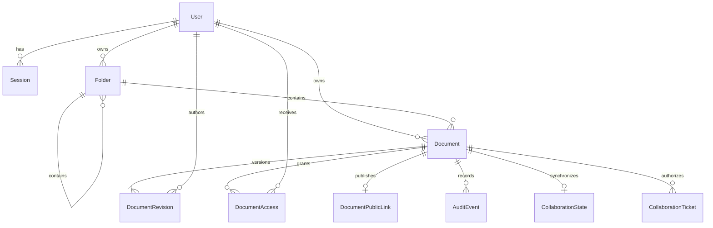

# Data Model

MySQL 8.4 with `InnoDB` and `utf8mb4` is the system of record. Prisma schema and reviewed migrations will implement this logical model. IDs are opaque UUIDs or CUID2 values; APIs never expose sequential database keys.

## Relationship Overview

## Entities

### `User`

| Field                                  | Notes                                            |
| -------------------------------------- | ------------------------------------------------ |
| `id`                                   | Opaque primary key                               |
| `email`                                | Display form, never used directly for uniqueness |
| `normalizedEmail`                      | Lowercased, trimmed identity key; unique         |
| `passwordHash`                         | Versioned scrypt encoded hash                    |
| `emailVerifiedAt`                      | Nullable until verification is implemented       |
| `sessionEpoch`                         | Increment to invalidate all sessions             |
| `createdAt`, `updatedAt`, `disabledAt` | UTC timestamps                                   |

### `Session`

| Field                                               | Notes                                                             |
| --------------------------------------------------- | ----------------------------------------------------------------- |
| `id`, `userId`                                      | Identity and owner                                                |
| `tokenHash`                                         | SHA-256 or keyed hash of 256-bit random token; unique             |
| `sessionEpoch`                                      | Must equal the user's current epoch                               |
| `expiresAt`, `lastSeenAt`, `revokedAt`, `createdAt` | Lifecycle                                                         |
| `userAgentSummary`, `ipPrefixHash`                  | Optional bounded security metadata, never raw fingerprinting data |

Indexes: unique `tokenHash`; `(userId, revokedAt, expiresAt)` for session management and cleanup.

### `Folder`

| Field                                 | Notes                                              |
| ------------------------------------- | -------------------------------------------------- |
| `id`, `ownerId`                       | Identity and owner                                 |
| `parentId`                            | Nullable self-reference; parent has the same owner |
| `name`, `normalizedName`              | Display and case-insensitive comparison values     |
| `createdAt`, `updatedAt`, `trashedAt` | Lifecycle                                          |

Constraint: unique `(ownerId, parentId, normalizedName)` for active siblings. Because MySQL unique indexes permit multiple `NULL` values and soft-deleted rows complicate uniqueness, implementation must use a deterministic parent sentinel/materialized scope key or an active-name reservation table. This must be proven by integration tests rather than assumed from Prisma declarations.

Cycle prevention and maximum depth are domain-service checks inside a transaction. A maximum depth of 20 is proposed.

### `Document`

| Field                                 | Notes                                                             |
| ------------------------------------- | ----------------------------------------------------------------- |
| `id`, `ownerId`                       | Identity and exactly one owner                                    |
| `folderId`                            | Nullable root location; folder belongs to owner                   |
| `name`, `normalizedName`              | Include `.md` consistently according to the final naming decision |
| `currentRevisionId`                   | Non-null after creation; references this document's head          |
| `createdAt`, `updatedAt`, `trashedAt` | Lifecycle                                                         |

Document name uniqueness follows the same active sibling strategy as folders. Folder and document namespaces may be independent in MVP; the UI should make type clear.

### `DocumentRevision`

| Field                     | Notes                                                           |
| ------------------------- | --------------------------------------------------------------- |
| `id`, `documentId`        | Identity and document                                           |
| `ordinal`                 | Monotonically increasing per document, unique with `documentId` |
| `authorId`                | User who saved or restored                                      |
| `content`                 | Immutable canonical Markdown text (`LONGTEXT`)                  |
| `byteSize`, `contentHash` | Validated UTF-8 size and SHA-256 digest                         |
| `saveMessage`             | Optional bounded user note                                      |
| `restoredFromRevisionId`  | Nullable lineage for restore operations                         |
| `createdAt`               | Immutable timestamp                                             |

No update or delete operation is exposed for a revision. Creation and document-head advancement occur in one transaction. `contentHash` helps integrity and deduplication analysis but does not replace authorization or revision identity.

### `DocumentAccess`

| Field                                   | Notes                                                                 |
| --------------------------------------- | --------------------------------------------------------------------- |
| `documentId`, `userId`                  | Composite identity                                                    |
| `role`                                  | `EDITOR` or `VIEWER`; owner is represented only by `Document.ownerId` |
| `grantedById`, `createdAt`, `updatedAt` | Provenance                                                            |

Constraints prohibit access rows for the owner. Deleting or trashing a document suspends access through query policy; permanent deletion cascades access rows only after retention policy permits.

### `CollaborationState`

| Field                  | Notes                                                               |
| ---------------------- | ------------------------------------------------------------------- |
| `documentId`           | One operational state per document                                  |
| `generation`           | Incremented when restore replaces the authoritative room generation |
| `stateFormat`          | Versioned representation: `LEGACY_TEXT_V1` or `MILKDOWN_XML_V1`     |
| `yjsState`             | Compacted Yjs update; durable operational state, not history        |
| `checkpointRevisionId` | Immutable revision represented by the latest explicit Save          |
| `updatedAt`            | Last operational-state persistence time                             |

### `CollaborationTicket`

One-time, document-scoped WebSocket credentials store only a token hash and bind the document, user, and authenticated session. Tickets expire after one minute and become invalid after first consumption. Session and document access are revalidated during consumption.

### `DocumentPublicLink`

| Field                    | Notes                                                    |
| ------------------------ | -------------------------------------------------------- |
| `documentId`             | Primary key; at most one active public link per document |
| `tokenHash`              | Unique SHA-256 hash of a 256-bit URL-safe bearer token   |
| `createdAt`, `updatedAt` | Creation and rotation timestamps                         |

The raw token is returned once when an owner creates or rotates a link and is never stored. Public resolution hashes the submitted token, rejects trashed documents and documents hidden by trashed ancestors, and reads only `Document.currentRevisionId`. Permanent document deletion cascades the link. Revocation deletes the row; rotation replaces the hash and immediately invalidates the previous token.

### Planned `Invitation`

| Field                                                             | Notes                                            |
| ----------------------------------------------------------------- | ------------------------------------------------ |
| `id`, `documentId`, `inviterId`                                   | Scope and actor                                  |
| `targetEmail`, `normalizedTargetEmail`                            | Recipient identity                               |
| `role`                                                            | `EDITOR` or `VIEWER`                             |
| `tokenHash`                                                       | Unique hash; raw token is never stored           |
| `expiresAt`, `acceptedAt`, `declinedAt`, `revokedAt`, `createdAt` | State timestamps                                 |
| `acceptedById`                                                    | Must match normalized target email at acceptance |

This model is planned but not present in the current Prisma schema. Current sharing grants existing active accounts directly through `DocumentAccess`. When pending-email invitations are implemented, only one active invitation per `(documentId, normalizedTargetEmail)` will be allowed and state transitions will be single-use and transactionally guarded.

### `AuditEvent`

Append-only security and collaboration facts such as login success/failure summary, session revocation, document create/trash/restore/delete, save, revision restore, invitation lifecycle, role change, and access revocation.

Fields include opaque `id`, `actorId`, `documentId`, stable `action`, bounded validated metadata JSON, `requestId`, and `createdAt`. Metadata excludes content, credentials, and raw tokens. Audit retention and administrator access require a separate policy before production.

## Save Transaction

1. Begin a transaction and select/lock the document.
2. Verify the actor is owner or active editor and the document is not trashed.
3. Compare `currentRevisionId` with submitted `baseRevisionId`.
4. On mismatch, roll back and return current head ID, ordinal, author summary, and timestamp, but not content unless a separate authorized fetch is made.
5. Compute the next ordinal, validate byte size, insert revision, update the head, and append audit event.
6. Commit and return the new head.

A unique `(documentId, ordinal)` constraint is the final guard against duplicate ordinals. Retry only known transient transaction errors; never retry a semantic revision conflict automatically.

## Collaborative Checkpoint

1. Authenticate and CSRF-check the HTTP checkpoint request.
2. Open the active Hocuspocus room and serialize against room persistence.
3. Serialize the exact authoritative versioned Yjs document to canonical Markdown and compacted Yjs state.
4. Revalidate owner/editor access inside the row-locked revision transaction.
5. Insert the immutable revision, advance `Document.currentRevisionId`, and advance `CollaborationState.checkpointRevisionId` atomically.
6. Broadcast validated revision metadata and the saved content hash to room clients.

WebSocket synchronization and operational-state persistence do not mean Saved. Only this explicit checkpoint advances immutable history.

## Revision Restore Transaction

1. Lock the document and revalidate owner/editor access.
2. Verify the submitted `baseRevisionId` is still the current head and the selected revision belongs to the document.
3. Insert a new immutable revision with copied Markdown, integrity metadata, restoring author, and `restoredFromRevisionId` lineage.
4. Advance the document head and, when collaboration state exists, replace compacted Yjs state, advance `checkpointRevisionId`, and increment `generation` in the same transaction.
5. Replace the active room text, persist that exact Yjs state, emit a restore control event, and disconnect clients so each creates a fresh local `Y.Doc` for the new generation.

Existing revisions are never updated. A stale local CRDT document is never merged into a restored generation.

## Live-State Format Migration

Existing rows default to `LEGACY_TEXT_V1`. A conversion acquires the document/room serialization boundary, extracts the full legacy shared draft, verifies that the configured Milkdown schema can parse and semantically round-trip it, creates a fresh `MILKDOWN_XML_V1` document, increments `generation`, and persists format plus state atomically. A lossy document is not converted automatically. Immutable `DocumentRevision.content` rows are never changed by this operation.

## Deletion And Retention

- Trash is soft deletion and reversible by the owner.
- A trashed folder makes owned descendants unavailable through normal APIs without rewriting every descendant immediately; subtree policy must be consistent in reads and writes.
- Permanent deletion requires explicit confirmation, authorization, a retention decision, and transactional cleanup or a durable background job.
- Production backups are encrypted and may retain deleted data until the backup retention window expires; user-facing policy must disclose this.
- Expired sessions and invitations are cleaned by an idempotent scheduled task.

## Migration Rules

- Use named Prisma migrations reviewed in source control.
- Never use `prisma db push` in shared or production environments.
- Test migrations on production-like MySQL collation and SQL mode.
- Destructive migrations require backup/restore evidence and a rollback or forward-fix plan.
- Seed scripts use synthetic data only and are safe to rerun.
